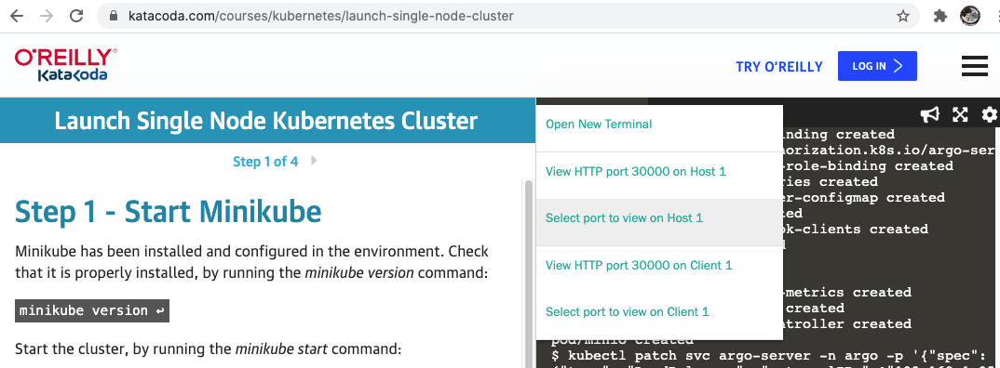

## Catalog Management System

](https://circleci.com/gh/deepaksinghvi/catalogwf/?branch=main)

Catalog Management System for e-commerce users (B2B or B2C), helps users to procurement items. 
A complete catalog management solution would have consumer-like shopping with a sophisticated procurement process. 
This example is primarily focusing on the catalog processing using workflow orchestration for workflow execution in a Kubernetes pods.

Catalog Workflow App Developed in GoLang.
High-level design for the Catalog Management App is as follows:


It works as the cli app as well as Restful WebService.
* ClI App is built using [Cobra](https://github.com/spf13/cobra) Library
* Restful WebService is built using [Gin Web Framework](https://github.com/gin-gonic/gin)  

Catalog Workflow has been integrated with [Argo Workflow](https://argoproj.github.io/workflows).  
Argo Workflows is an open source container-native workflow engine for orchestrating parallel jobs on Kubernetes.

### Pre-Requisites
* Run Catalog Workflow App [Local or Remote](#build-&-run).
* Run Argo-Workflow  (Local or Remote)


### Build & Run
```
go build
go mod
go vendor

./catalogwf catalogservice
```

#### Build Docker Image
```
docker build -t catalogwf .
docker run -p 8080:8080 -it --name catalogprocesslocal catalogwf catalogservice

```

Access application at http://localhost:8080/swagger/index.html


#### To push image to docker-hub
```
docker tag catalogwf deepaksinghvi/catalogwf:latest
docker push deepaksinghvi/catalogwf:latest
```

### Run Argo Workflow in Kubernetes Cluster

#### Run Argo Locally
```
minikube start
minikube dashboard
kubectl create ns argo
kubectl apply -n argo -f https://raw.githubusercontent.com/argoproj/argo-workflows/release-2.12.1/manifests/quick-start-minimal.yaml

//verify pods are up and running
kubectl -n argo get pods

// access argo server (previously known as argo-ui)
kubectl -n argo port-forward svc/argo-server 2746:2746
```


#### Run Argo on Katacoda (free)
Create Kubernetes cluster via Katacoda in browser

https://www.katacoda.com/courses/kubernetes/launch-single-node-cluster
Run only Step1 of Step4 and run the commands below

```
kubectl create ns argo
kubectl apply -n argo -f https://raw.githubusercontent.com/argoproj/argo-workflows/release-2.12.1/manifests/quick-start-minimal.yaml
kubectl patch svc argo-server -n argo -p '{"spec": {"type": "LoadBalancer", "externalIPs":["192.1.1.1"]}}'
kubectl get svc -n argo argo-server
```
Use externalIPs as your machine's IP Address

Resuls for argo-server service
```
$ kubectl get svc -n argo argo-server  
NAME          TYPE           CLUSTER-IP     EXTERNAL-IP    PORT(S)          AGE
argo-server   LoadBalancer   111.22.33.44   192.1.1.1   2746:31513/TCP   42s
```

Click on plus (+) icon and Click "Select port to view on Host 1"


Set 31513 as the port in page "Web Preview Port Selector" and Click on "Display Port"
https://2886795277-31513-ollie07.environments.katacoda.com/  
This would open argo-server.

### Create Workflow Template
Publish Catalog Workflow Template
Copy contents from [catalogworkflow.yaml](resources/catalogworkflow.yaml) and create template as follows:


### Initiate A Catalog Workflow via API
Run CatalogWF App
Run Argo-Workflow (local or remote)
Find base url of Argo Server (Argo UI) for e.g. http://localhost:2746
Execute Initiate Catalog Workflow Request as follows


```
{
  "baseurl": "http://localhost:2746",
  "workflowtemplate": {
    "namespace": "argo",
    "resourceKind": "WorkflowTemplate",
    "resourceName": "catalog-workflow-step-g9rv6",
    "submitOptions": {
      "entryPoint": "catalogprocess",
      "parameters": [
        "catalogname=test-workflow-name"
      ]
    }
  }
}
```


User would need to change resourceName as for my current deployment name of the template is 
"catalog-workflow-step-g9rv6"

#### Submit Workflow request directly to Argo Workflow APIs using CURL
```
curl 'http://localhost:2746/api/v1/workflows/argo/submit' \
  -H 'Content-Type: application/json' \
  -H 'Accept: */*' \
  --data-raw '{"namespace":"argo","resourceKind":"WorkflowTemplate","resourceName":"catalog-workflow-step-g9rv6","submitOptions":{"entryPoint":"catalogprocess","parameters":["catalogname=test-workflow-name"]}}'
```

#### Submit Workflow request directly to Argo Workflow APIs using Argo Server (Argo UI)


### Update Swaggo Document
```
swag init
```
